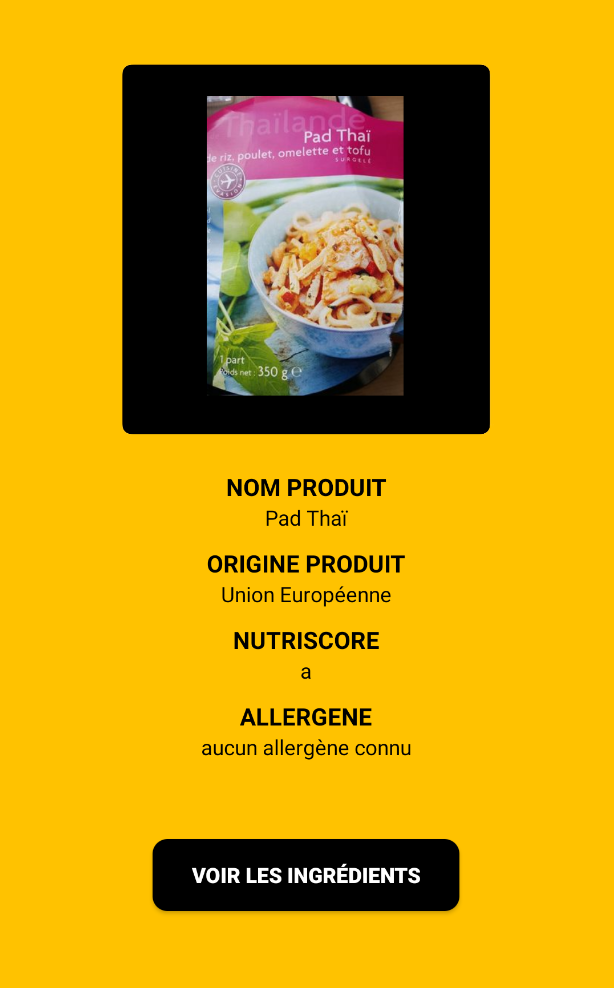
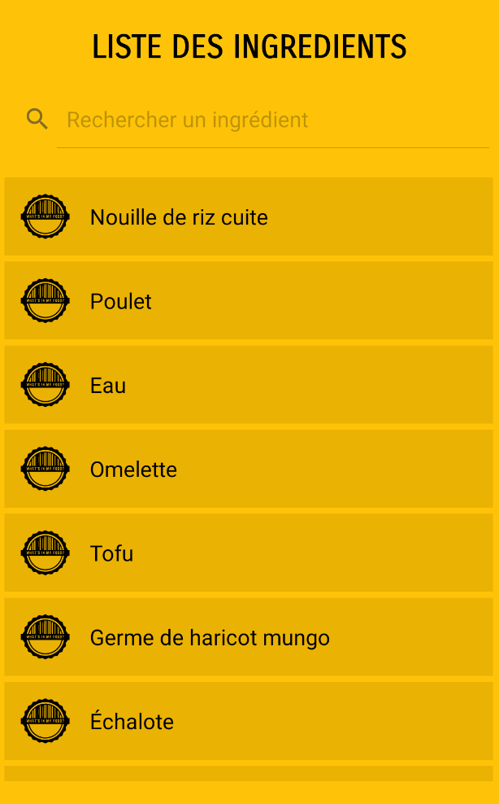
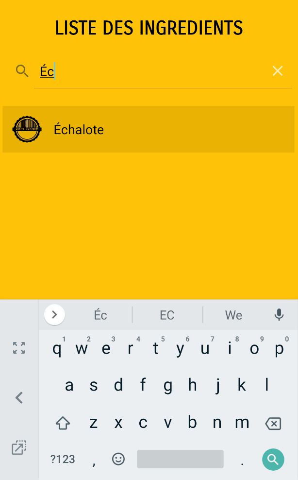

# Application "What's in my food"

## Présentation

Cette application affiche des informations concernant n'importe quel produit alimentaire. Elle utilise l'API OpenFoodFact.

## Prérequis

* Installation d'Android Studio
* Récupération de l'Api

```
https://world.openfoodfacts.org/api/v0/product/{code}.json
```

## Consignes respectées

* Écran avec une liste d'éléments
* Écran avec le détail d'un élément
* Écrans: 5 activités 
* Appel WebService à une API Rest
* Stockage des données en caches
* Singletons
* Architecture MVC
* Design


## Fonctionnalités

### Premier écran

* Menu affichant le logo et un espace pour rentré le code barre du produit

 


### Deuxième écran

* Si le code barre rentré est inexistant, l'utilisateur est redirigé vers cet écran
* Affichage d'un message d'erreur et d'un bouton cliquable permettant de revenir au menu


### Troisième écran

* Affiche des informations sur le produit et le bouton voir les ingrédients est cliquable 




### Quatrième écran

* Affiche la liste des ingrédients présents dans le produit
  * Une barre de recherche permet de chercher un produit en particulier
  * Tous les ingrédients son cliquables 
 
 

### Cinquième écran

* Lorsque l'on clique sur un ingredient, on est redirigé vers ce quatrième écran qui affiche le pourcentage maximum et minimum de l'ingrédient pouvant être présent dans le produit


